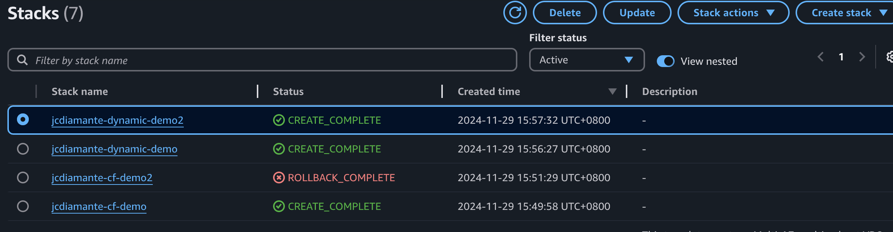

# CloudFormationStack-Dynamic-Static

## 🗄️ Files
1. jcdiamante-static-cf.yml
Contains the CloudFormation template for the static stacks, `demo1` is **successful** and `demo2` **fails**.

2. jcdiamante-dynamic-template.yml
Contains the CloudFormation template for the dynamic stacks, `dynamic-demo1` and `dynamic-demo2` are both **successful**.

## ✅ Proof
